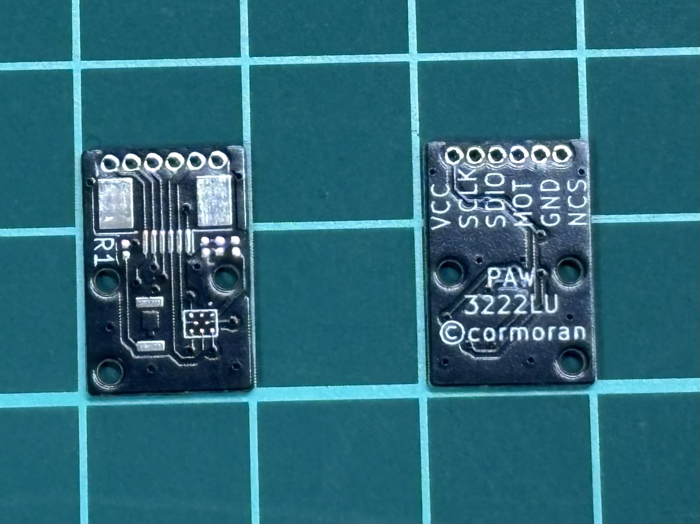

# PAW3222-LU breakout board

I've never assembled it. I don't know whether it works or not!

動作未確認！

**Drill hole size is slightly smaller than lens's bump. You should change it to slightly larger.**

- height 9mm
- width 14.8mm
- 6pin 0.5mm pitch FFC
- 6pin 1.27mm pitch hole for testing
- Designed for 1 layer PCB assembly

How it was designed -> https://x.com/cormoran707/status/1889661277347193108
